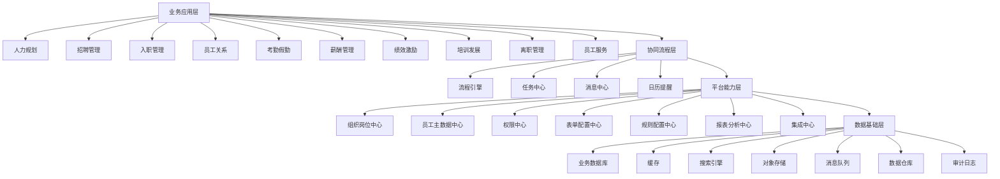
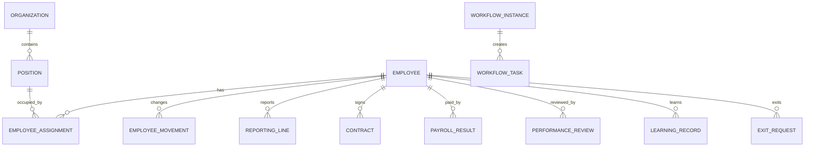

# HR 系统完整系统方案

## 1. 方案概述

本文档面向从 0 到 1 建设一套全平台 HR 系统，覆盖产品定位、业务范围、应用架构、数据架构、技术架构、流程权限、系统集成、实施路线、交付计划和风险控制。

系统以员工生命周期为主线，以组织岗位、员工主数据、流程引擎、权限体系、数据分析为核心底座，逐步建设招聘、入职、员工关系、考勤假勤、薪酬、绩效、培训发展、离职和员工服务等能力。

## 2. 建设目标

### 2.1 业务目标

1. 打通员工从规划、招聘、入职、在职、发展、激励、离职到服务的完整生命周期。
2. 统一企业组织、岗位、人员、合同、任职、汇报关系等主数据。
3. 降低 HR 事务性工作成本，提高 HRBP、COE、SSC 协同效率。
4. 支撑员工自助、主管自助和高管人力决策。
5. 通过流程、权限、审计和数据治理提升合规能力。

### 2.2 技术目标

1. 建立可扩展、可配置、可集成的企业级 HR 平台。
2. 业务模块与平台能力解耦，避免模块之间直接互相改库。
3. 支持多组织、多法人、多地区、多角色、多数据范围。
4. 支持后续向微服务、数据仓库、AI 能力平滑演进。
5. 对薪酬、证件、合同、绩效等敏感数据提供高安全保护。

## 3. 系统定位

系统定位为企业级人力资源数字化运营平台，而不是单一 HR 工具。

核心能力：

1. 员工生命周期管理。
2. 组织与岗位主数据管理。
3. 员工主数据管理。
4. 审批流程与任务协同。
5. 角色权限、数据权限和字段权限。
6. 人力数据分析与经营看板。
7. 外部系统集成与数据同步。

## 4. 用户角色

| 角色 | 核心诉求 |
| --- | --- |
| 员工 | 自助查询、申请、学习、确认、服务 |
| 直属主管 | 团队审批、绩效评价、团队信息查看 |
| 部门负责人 | 编制、招聘、人力成本、绩效、离职风险 |
| HRBP | 负责组织的人力运营、员工关系、数据分析 |
| HR COE | 制度、规则、薪酬、绩效、培训、招聘专业管理 |
| HR SSC | 入转调离、合同、档案、证明、服务工单 |
| 招聘 HR | 招聘需求、候选人、面试、Offer、人才库 |
| 薪酬 HR | 薪资档案、核算、审批、发放、工资单 |
| 系统管理员 | 用户、角色、权限、流程、表单、集成、审计 |
| 高管 | 人力驾驶舱、趋势分析、组织效率和成本分析 |

## 5. 总体业务架构


业务闭环：

1. 战略到编制：战略目标 -> 组织规划 -> 岗位规划 -> 编制预算 -> 招聘计划。
2. 招聘到入职：招聘需求 -> 候选人 -> 面试 -> Offer -> 预入职 -> 员工档案。
3. 入职到发展：入职 -> 新人培训 -> 试用期 -> 转正 -> 学习地图 -> 人才盘点。
4. 绩效到激励：目标 -> 评价 -> 校准 -> 面谈 -> 奖金、调薪、晋升、培训。
5. 考勤到薪酬：考勤工时 -> 薪资输入 -> 薪酬核算 -> 审批 -> 发放。
6. 异动到组织：转正、调岗、调薪、晋升 -> 任职历史 -> 组织岗位同步。
7. 离职到复盘：离职申请 -> 交接 -> 结算 -> 归档 -> 离职分析。

## 6. 应用架构

系统分为四层：业务应用层、协同流程层、平台能力层、数据基础层。



## 7. 产品模块方案

### 7.1 人力资源规划

范围：

1. 组织规划。
2. 岗位规划。
3. 编制管理。
4. HC 预算。
5. 人力成本预算。
6. 招聘计划。
7. 培训计划。
8. 绩效激励规划。

边界：

1. 负责规划和预算，不负责具体招聘执行。
2. 编制结果作为招聘、调岗、组织调整的约束。
3. 人力成本预算为薪酬和财务分析提供口径。

### 7.2 招聘管理

范围：

1. 招聘需求申请和审批。
2. 职位发布。
3. 简历解析和候选人管理。
4. 面试安排和面试评价。
5. Offer 审批。
6. 背调。
7. 人才库。
8. 入职前保温。

边界：

1. 管理候选人到 Offer 接受。
2. Offer 接受后移交入职管理。
3. 正式员工档案归员工主数据中心。

### 7.3 入职管理

范围：

1. 入职信息采集。
2. 入职材料收集。
3. 劳动合同签署。
4. 工卡、设备、账号、座位准备。
5. 入职任务清单。
6. 新员工指引。
7. 员工档案生成。
8. 试用期计划初始化。

边界：

1. 负责预入职到正式入职。
2. 入职完成后生成 Employee、EmployeeAssignment、ReportingLine。
3. 新人培训任务由培训发展模块承接。

### 7.4 员工关系与服务

范围：

1. 员工档案。
2. 转正管理。
3. 调岗、调薪、晋升、异动。
4. 合同管理。
5. 员工面谈。
6. 员工异常处理。
7. 服务工单。
8. 证明开具。
9. 政策制度查询。

边界：

1. 承载在职员工日常 HR 事务。
2. 异动结果同步员工主数据、组织岗位和薪酬档案。
3. 服务工单可集成 IT、行政、财务等外部系统。

### 7.5 考勤假勤

范围：

1. 考勤规则。
2. 考勤记录。
3. 请假申请。
4. 加班申请。
5. 出差和外勤。
6. 工时汇总。
7. 异常考勤处理。

边界：

1. 负责考勤原始数据和工时结果。
2. 工时结果作为薪酬核算输入。
3. 可对接外部考勤设备或企业微信、钉钉、飞书。

### 7.6 薪酬管理

范围：

1. 薪资档案。
2. 薪资项配置。
3. 薪资规则配置。
4. 考勤、社保、公积金、福利、奖金、扣款数据接入。
5. 个税计算。
6. 薪酬核算。
7. 薪资核对和审批。
8. 银行发放文件。
9. 工资单。
10. 薪酬报表。

边界：

1. 负责薪资计算、审批和发放。
2. 不负责考勤原始数据采集。
3. 薪酬数据属于高敏数据，必须接入字段权限、数据权限和审计。

### 7.7 绩效与激励

范围：

1. 绩效周期。
2. OKR/KPI 目标。
3. 自评、上级评、多方评。
4. 绩效校准。
5. 绩效面谈。
6. 价值观评价。
7. 奖金方案。
8. 绩效结果应用。

边界：

1. 负责绩效过程和结果。
2. 奖金、调薪、晋升建议输出给薪酬和员工关系模块。
3. 不直接修改员工任职和薪酬主数据。

### 7.8 培训与发展

范围：

1. 课程管理。
2. 学习地图。
3. 新人培训。
4. 培训计划。
5. 考试测评。
6. 学习记录。
7. 试用期管理。
8. 人才盘点。
9. 继任计划。
10. 晋升晋级评估。
11. 发展计划。

边界：

1. 负责能力发展和人才管理。
2. 晋升结果通过异动流程同步员工主数据。
3. 培训费用如需预算控制，应集成财务或预算系统。

### 7.9 离职管理

范围：

1. 发起离职。
2. 离职审批。
3. 离职面谈。
4. 工作交接。
5. 资产归还。
6. 账号回收。
7. 离职手续办理。
8. 离职结算。
9. 离职证明。
10. 离职原因分析。

边界：

1. 负责待离职到已离职闭环。
2. 离职结算由薪酬模块计算。
3. 离职完成后更新员工状态并结束任职。

## 8. 平台底座方案

### 8.1 组织岗位中心

核心对象：

1. Organization。
2. Position。
3. Job。
4. JobFamily。
5. JobGrade。
6. JobLevel。
7. LegalEntity。
8. CostCenter。
9. WorkLocation。

关键能力：

1. 组织树。
2. 岗位和编制。
3. 职位说明和任职资格。
4. 职级职等。
5. 组织历史。
6. 岗位历史。

> MVP 范围：`CostCenter` 主数据与独立管理页延后；组织部门仅保留 `cost_center` 文本属性。

### 8.2 员工主数据中心

核心对象：

1. Employee（身份与稳定主数据 + 联系/紧急联系人列）。
2. EmployeeAssignment（职务数据 / 任职，含岗位、组织、雇工、工作关系属性）。
3. ReportingLine（汇报关系）。
4. EmployeeMovement（职务数据异动事件）。
5. **员工档案子表**（§4.3）：证件、家属、内部亲属、成本中心、合同/协议、员工服务 6 类、背景 4 类、人才发展 6 类 — **均在 MVP Slice 7 落表**。
6. EmployeeAttachment（受控附件）。

**档案信息架构**（来源：业务材料《员工档案和移动类型.xlsx》；**MVP Slice 7 须全覆盖**）：

| 一级模块 | 二级模块（共 27 项） | MVP 交付方式 |
| --- | --- | --- |
| 个人信息 | 个人基础、证件、联系、家属&紧急联系人、内部亲属 | Slice 7.1：主档 + 子表 CRUD |
| 工作信息 | 岗位、组织、雇工、工作关系、成本中心分摊、合同与协议 | Slice 7.2：assignment + 子表 |
| 员工服务 | 考勤卡、银行卡、社保公积金、特殊福利、班车住宿、附件 | Slice 7.3：子表 CRUD |
| 背景信息 | 教育、工作经历、资格职称、奖惩 | Slice 7.4：子表 CRUD |
| 人才发展 | 培训、绩效、价值观、盘点、项目、智能体归属 | Slice 7.5：**档案多行记录**（非独立业务模块） |

关键原则：

1. Employee 只承载员工身份和稳定主数据；证件、家属等一对多信息独立子表。
2. 任职（职务数据）独立建模，所有组织/岗位/雇工属性变更带生效日期。
3. 异动必须有事件和历史；操作码采用 **HIR / REH / PRC / SPR / PRO / DEM / DTA / XFR / PAY / TER**，并记录原因码与原因子项。
4. **档案 vs 模块**：培训/绩效/盘点/LMS/项目 PMO/智能体编排 **不做独立 MVP 模块**；须在员工档案内 **记录** 培训记录、历史绩效结果、盘点结论等，供 HR 维护或后续流程回写。
5. 失效的历史异动原因码（如旧版 TER 细项、PA1–PA6）仅只读保留，新单据不使用。

**职务数据异动类型（有效操作码）**：

| 操作码 | 含义 | 典型场景 |
| --- | --- | --- |
| HIR | 雇佣 | 初次入职、开始兼职 |
| REH | 重新雇佣 | 离职后再入职、退休返聘 |
| PRC | 转正 | 正常/提前/延迟转正 |
| SPR | 雇佣类型变更 | 临时工/实习生/非正式工转正 |
| PRO | 晋升晋级 | 管理干部任命、晋升、晋级 |
| DEM | 降职降级 | 降职、降级 |
| DTA | 数据更改 | 主数据更正、岗位同步、组织负责人变更 |
| XFR | 调动 | 部门内/跨部门/活水/跨法人等 |
| PAY | 调薪 | 晋升/转正/转岗/年度/绩效调薪（薪酬模块对接） |
| TER | 离职 | 主动/被动离职、退休、死亡、放弃报到等 |

详细原因码见 `docs/领域模型与表设计-MVP.md` §4.7。

### 8.3 流程引擎

核心对象：

1. WorkflowDefinition。
2. WorkflowNode。
3. WorkflowInstance。
4. WorkflowTask。
5. WorkflowAction。

关键能力：

1. 流程模板和版本管理。
2. 审批人解析。
3. 条件分支。
4. 会签、或签、顺序审批。
5. 撤回、驳回、转交、加签、委托。
6. 待办、已办、抄送。
7. 审批轨迹和审计。

### 8.4 权限中心

权限模型：

1. RBAC 角色。
2. 功能权限点位。
3. 数据范围。
4. 字段权限。
5. 审计日志。

关键原则：

1. 角色来自统一平台角色体系。
2. 不在业务模块自建平行角色体系。
3. 后端必须执行鉴权。
4. 薪酬、证件、银行、合同等高敏字段必须脱敏和审计。
5. 导出权限独立于查看权限。

### 8.5 表单与规则配置中心

能力：

1. 自定义字段。
2. 自定义表单。
3. 字段校验。
4. 字段显隐。
5. 字段只读。
6. 编码规则。
7. 字典配置。
8. 业务规则参数。

边界：

1. 表单配置解决差异化采集。
2. 不替代核心领域模型。
3. 关键对象仍需稳定表结构。

### 8.6 消息与任务中心

能力：

1. 待办。
2. 已办。
3. 抄送。
4. 站内信。
5. 邮件。
6. 短信。
7. 企业微信、钉钉、飞书通知。
8. 日历提醒。

### 8.7 报表分析中心

核心指标：

1. 总人数。
2. 入职人数。
3. 离职人数。
4. 离职率。
5. 编制使用率。
6. 人力成本。
7. 人均成本。
8. 招聘转化率。
9. Offer 接受率。
10. 平均招聘周期。
11. 绩效分布。
12. 培训完成率。
13. 缺勤率。
14. 加班时长。

## 9. 数据架构

### 9.1 核心数据域

| 数据域 | 核心对象 |
| --- | --- |
| 组织域 | Organization、Position、Job、Grade、CostCenter |
| 员工域 | Employee、Assignment、ReportingLine、Movement |
| 招聘域 | RecruitmentRequest、Candidate、Resume、Interview、Offer |
| 入职域 | PreEmployee、OnboardingTask、Contract、Document |
| 员工关系域 | Regularization、Transfer、Contract、EmployeeCase、ServiceTicket |
| 考勤域 | AttendanceRecord、LeaveRequest、OvertimeRequest、WorkHour |
| 薪酬域 | SalaryProfile、SalaryItem、PayrollPeriod、PayrollResult、Payslip |
| 绩效域 | PerformanceCycle、Goal、Review、Calibration、Result |
| 培训域 | Course、TrainingPlan、LearningPath、Exam、TalentReview |
| 离职域 | ExitRequest、ExitInterview、HandoverTask、FinalPayroll |
| 平台域 | Workflow、Permission、Form、Notification、AuditLog |

### 9.2 核心关系



### 9.3 数据治理原则

1. 主数据统一来源，业务模块只引用，不重复维护。
2. 当前态和历史态分离。
3. 重要业务变更通过事件沉淀。
4. 业务编码和系统主键分离。
5. 敏感字段加密、脱敏、审计。
6. 报表按统一指标口径计算。
7. 数据导入必须校验唯一性、完整性和时间有效性。

## 10. 技术架构

### 10.1 架构策略

0 到 1 阶段建议采用模块化单体优先，保留服务化边界。

理由：

1. HR 业务模块多，但早期团队更需要交付效率。
2. 组织、员工、流程、权限之间依赖强，过早微服务会增加事务和联调成本。
3. 模块化单体可以先按领域拆包，后续再拆服务。

中长期可演进为领域服务：

1. IAM 服务。
2. 组织员工主数据服务。
3. 招聘服务。
4. 员工关系服务。
5. 薪酬服务。
6. 绩效服务。
7. 培训服务。
8. 流程服务。
9. 报表服务。
10. 集成服务。

### 10.2 推荐技术栈

前端：

1. React + TypeScript。
2. Tailwind CSS。
3. shadcn/ui。
4. React Query。
5. Zustand 或 Redux Toolkit。
6. ECharts。

后端：

1. Java。
2. Spring Boot。
3. REST API 优先。
4. OpenAPI 维护接口契约。
5. 复杂报表查询可独立报表服务承载。

数据与中间件：

1. MySQL：核心业务数据。
2. Redis：缓存、会话、临时状态。
3. Elasticsearch / OpenSearch：简历、员工、全文检索。
4. MinIO / S3：简历、合同、证件、附件。
5. Kafka / RabbitMQ：业务事件、异步任务。
6. ClickHouse / StarRocks：分析型报表。

部署：

1. Docker。
2. Kubernetes 作为中长期目标。
3. CI/CD。
4. Dev、Test、Staging、Prod 多环境。
5. 日志、监控、告警、链路追踪。

### 10.3 后端分层

```text
Controller/API 层
├─ 接口鉴权
├─ DTO 校验
└─ 请求响应转换

Application 应用层
├─ 用例编排
├─ 事务控制
├─ 流程发起
└─ 事件发布

Domain 领域层
├─ 业务规则
├─ 状态机
├─ 领域对象
└─ 领域服务

Infrastructure 基础设施层
├─ Repository
├─ 外部系统适配
├─ 消息队列
├─ 文件存储
└─ 搜索索引
```

## 11. 集成架构

### 11.1 集成对象

| 系统 | 集成内容 |
| --- | --- |
| SSO / AD / LDAP | 用户身份、账号登录、组织同步 |
| 企业微信 / 钉钉 / 飞书 | 通讯录、待办、消息、审批入口 |
| 招聘渠道 | 职位发布、简历接入 |
| 电子签 | 劳动合同、协议签署 |
| 考勤设备 | 打卡记录、考勤原始数据 |
| 银行 | 发放文件或支付接口 |
| 财税系统 | 个税、社保、公积金 |
| 财务系统 | 成本中心、人力成本、预算 |
| OA / ITSM | 资产、账号、行政服务、工单 |
| BI 平台 | 指标数据、分析模型 |

### 11.2 集成方式

1. REST API。
2. Webhook。
3. 文件导入导出。
4. 消息队列。
5. 定时同步。
6. 单点登录。

### 11.3 集成原则

1. 集成中心负责适配和监控。
2. 业务模块不直接散落对接外部系统。
3. 同步任务需要重试、幂等和失败告警。
4. 外部编码和内部主键分离，保留 external_code。
5. 敏感数据传输必须加密。

## 12. 安全与合规

### 12.1 权限安全

1. 后端接口必须鉴权。
2. 菜单、按钮、数据、字段四层权限联动。
3. 数据范围按本人、下属、部门、组织、法人、成本中心控制。
4. 高敏字段独立授权。
5. 系统管理员默认不拥有薪酬明细查看权。

### 12.2 数据安全

1. 证件号、手机号、银行账户、薪酬字段加密存储或脱敏展示。
2. 导出动作单独授权。
3. 高敏查看和导出强审计。
4. 附件访问使用短期签名 URL 或受控下载接口。
5. 离职员工账号及时禁用，但历史数据保留。

### 12.3 审计要求

必须审计：

1. 敏感字段查看。
2. 员工数据导出。
3. 薪酬核算和导出。
4. 组织岗位调整。
5. 员工主数据修改。
6. 角色权限调整。
7. 审批动作。
8. 批量导入和批量更新。

## 13. 推荐产品菜单

```text
首页
├─ 人力驾驶舱
├─ 组织管理
│  ├─ 组织架构
│  ├─ 岗位管理
│  ├─ 编制管理
│  └─ （成本中心主数据，MVP 延后）
├─ 员工管理
│  ├─ 员工档案
│  ├─ 入职管理
│  ├─ 转正管理
│  ├─ 调岗调薪
│  ├─ 合同管理
│  └─ 离职管理
├─ 招聘管理
│  ├─ 招聘需求
│  ├─ 职位发布
│  ├─ 候选人
│  ├─ 面试管理
│  ├─ Offer 管理
│  └─ 人才库
├─ 考勤假勤
│  ├─ 考勤记录
│  ├─ 请假管理
│  ├─ 加班管理
│  └─ 工时管理
├─ 薪酬管理
│  ├─ 薪资档案
│  ├─ 薪资项配置
│  ├─ 薪酬核算
│  ├─ 薪资审批
│  └─ 工资单
├─ 绩效激励
│  ├─ 绩效周期
│  ├─ 目标管理
│  ├─ 绩效评估
│  ├─ 绩效校准
│  └─ 奖金激励
├─ 培训发展
│  ├─ 课程管理
│  ├─ 培训计划
│  ├─ 学习地图
│  ├─ 人才盘点
│  └─ 晋升评估
├─ 员工服务
│  ├─ 服务工单
│  ├─ 证明申请
│  ├─ 政策查询
│  └─ 员工关怀
└─ 系统设置
   ├─ 用户角色
   ├─ 权限配置
   ├─ 审批流程
   ├─ 表单配置
   ├─ 字典配置
   ├─ 集成配置
   └─ 审计日志
```

## 14. MVP 建设范围

MVP 目标：先打通组织、员工、流程、权限和入转调离闭环。

### 14.1 MVP 必做

1. 组织架构。
2. 岗位管理。
3. 职位和职级。
4. 法人（成本中心主数据延后；组织部门保留 `cost_center` 文本字段）。
5. 员工档案（**27 项二级模块**，见领域模型 §4.1）。
6. 当前任职。
7. 汇报关系。
8. 员工异动历史。
9. 入职管理。
10. 转正管理。
11. 调岗调薪。
12. 合同管理。
13. 离职管理。
14. 基础流程引擎。
15. 基础权限体系。
16. 待办和消息。
17. 基础人力报表。

### 14.2 MVP 延后

1. 完整招聘 ATS。
2. 完整薪酬规则引擎。
3. 完整绩效校准。
4. 完整 LMS。
5. 人才盘点和继任计划 **独立模块**（档案内盘点记录见 Slice 7.5）。
6. AI 简历解析。
7. 智能员工问答。
8. 高级人力预测。

### 14.3 MVP 验收标准

1. 能维护组织、岗位、职级、法人；组织部门可填写成本中心文本。
2. 能创建和维护员工档案（**27 项二级模块** 均可维护）。
3. 能跑通入职、转正、调岗、调薪、离职流程。
4. 能沉淀任职历史和员工异动历史。
5. 能按角色、组织、数据范围控制权限。
6. 能对敏感字段脱敏和审计。
7. 能输出基础人力报表。
8. 能通过待办和消息驱动审批协同。

## 15. 实施路线图

### 阶段 0：方案与基础设计，2-3 周

交付：

1. 产品蓝图。
2. 领域模型。
3. 流程权限方案。
4. 技术架构方案。
5. MVP 范围和里程碑。
6. 原型和关键流程评审。

### 阶段 1：平台底座与主数据，6-8 周

交付：

1. 组织岗位中心。
2. 员工主数据中心。
3. 权限中心基础能力。
4. 流程引擎基础能力。
5. 表单、字典、编码规则。
6. 文件附件能力。
7. 审计日志。

### 阶段 2：入转调离与员工服务，6-8 周

交付：

1. 入职管理。
2. 转正管理。
3. 调岗调薪。
4. 合同管理。
5. 离职管理。
6. 员工自助。
7. 主管自助。
8. 基础人力驾驶舱。

### 阶段 3：招聘、考勤、薪酬、绩效，10-14 周

交付：

1. 招聘需求、候选人、面试、Offer。
2. 考勤假勤。
3. 薪资档案、薪酬核算、工资单。
4. 绩效周期、目标、评价、结果确认。
5. 薪酬和绩效敏感权限。

### 阶段 4：培训发展、人才和数据智能，8-12 周

交付：

1. 课程和培训计划。
2. 学习地图。
3. 人才盘点。
4. 晋升评估。
5. 继任计划。
6. 高级报表。
7. AI 能力试点。

## 16. 团队与职责建议

| 角色 | 职责 |
| --- | --- |
| 产品负责人 | 产品蓝图、需求优先级、业务验收 |
| HR 业务负责人 | 业务规则、制度口径、流程确认 |
| 架构师 | 系统架构、数据架构、集成架构 |
| 后端工程师 | 业务模块、流程权限、接口实现 |
| 前端工程师 | 管理端、员工端、主管端、配置后台 |
| 测试工程师 | 功能测试、流程测试、权限测试、回归测试 |
| 数据工程师 | 报表指标、数据仓库、数据质量 |
| 运维/DevOps | 环境、发布、监控、备份、安全 |
| 实施顾问 | 数据初始化、用户培训、上线支持 |

## 17. 关键风险与应对

| 风险 | 影响 | 应对 |
| --- | --- | --- |
| 一开始范围过大 | 项目延期、质量下降 | MVP 优先，分阶段交付 |
| 主数据模型不稳定 | 后续模块返工 | 先固化组织、岗位、员工、任职模型 |
| 只做菜单权限 | 数据越权 | 建立数据权限和字段权限 |
| 薪酬安全不足 | 严重合规风险 | 高敏字段加密、脱敏、审计、独立授权 |
| 流程写死 | 后续维护困难 | 流程模板和条件分支配置化 |
| 外部系统集成混乱 | 数据不一致 | 建立集成中心和数据源责任 |
| 报表口径不统一 | 管理决策失真 | 建立指标口径和数据治理机制 |
| 过早微服务化 | 开发和运维成本高 | 模块化单体优先，保留服务边界 |

## 18. 核心交付物清单

方案类：

1. 《HR 系统完整系统方案》。
2. 《HR 系统产品蓝图与模块边界》。
3. 《员工主数据与组织岗位数据模型》。
4. 《流程引擎与权限体系设计》。
5. 《MVP 版本需求清单与里程碑计划》。

设计类：

1. 《HR 系统核心数据库表设计》。
2. 《HR 系统 API 边界与集成方案》。
3. 《员工入转调离业务流程与状态机设计》。
4. 《权限点位清单与角色授权矩阵》。
5. 《流程模板配置样例》。
6. 《信息安全与审计方案》。

实施类：

1. 原型设计。
2. 数据初始化模板。
3. 测试用例。
4. 上线迁移方案。
5. 用户培训手册。
6. 运维监控方案。

## 19. 结论

本系统应以“组织岗位 + 员工主数据 + 流程权限”为第一优先级，先建立稳定的人力资源数字化底座，再逐步扩展招聘、薪酬、绩效、培训、人才和智能分析能力。

建设顺序建议：

1. 先主数据。
2. 再流程权限。
3. 再入转调离。
4. 再招聘、薪酬、绩效。
5. 最后发展、人才、AI 和高级分析。

这个顺序能最大程度降低返工，让系统从第一版开始就具备企业级扩展能力。
