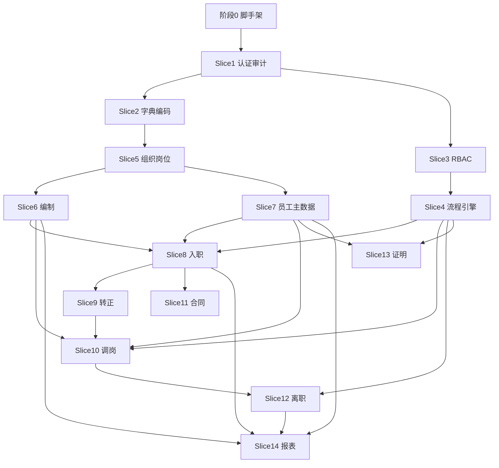

# MVP AI 开发路线图

> 面向 Cursor Agent 的垂直切片任务清单。每完成一个 Slice 应可独立演示、独立验收。

## 阶段 0：脚手架（Slice 0）

**目标**：空项目可启动，前后端联通。

| # | 任务 | 产出 | 验收 |
| --- | --- | --- | --- |
| 0.1 | 初始化 `server/` Spring Boot 3 + MyBatis-Plus + Flyway | 可启动，健康检查 `/api/v1/health` | curl 返回 200 |
| 0.2 | 初始化 `client/` Vite + React 19 + shadcn + Router | `AdminLayout`（顶栏 + 面包屑 + 菜单配置）+ 404 | 对齐 `docs/前端UI与信息架构规范.md`；`npm run dev` 可访问 |
| 0.3 | 创建 `shared/api.interface.ts` + 路径别名 | 前后端可 import 共享类型 | TS 编译通过 |
| 0.4 | 统一响应体、全局异常、traceId | `ApiResponse<T>` 封装 | 错误请求返回标准 JSON |
| 0.5 | `.env` 示例 + README 启动命令 | 新成员 30 分钟内跑通 | 文档可执行 |

## 阶段 1：平台底座（Slice 1–4）

### Slice 1：认证与审计基础

| 任务 | 说明 |
| --- | --- |
| 用户表 `sys_user`、登录 API | MVP 可用用户名密码，预留 SSO |
| JWT / Session + 鉴权过滤器 | 除 health/login 外需 token |
| `audit_log` 表 + AOP 切面 | 记录写操作与敏感读 |

### Slice 2：字典与编码

| 任务 | 说明 |
| --- | --- |
| `dict_type` / `dict_item` | 员工状态、合同类型等 |
| 编码规则服务 | 工号、组织编码自动生成 |
| 管理端字典维护页 | CRUD + 缓存 |

### Slice 3：权限 RBAC

| 任务 | 说明 |
| --- | --- |
| `role` / `permission` / `role_permission` / `user_role` | 功能点字符串如 `employee:view` |
| 数据范围解析器 | SELF / DEPARTMENT / ALL |
| 菜单与按钮权限 Hook | 前端 `usePermission` |
| `@PreAuthorize` 或自定义注解 | 后端强制鉴权 |

### Slice 4：流程引擎（最小可用）

| 任务 | 说明 |
| --- | --- |
| `workflow_definition` / `instance` / `task` | 支持顺序审批 |
| 审批人解析 | 直属上级、指定角色、发起人自选 |
| 待办/已办 API + 页面 | 任务中心首页 |
| 流程与业务解耦 | 业务 Service 发起流程，回调 Domain 状态机 |

## 阶段 2：主数据（Slice 5–7）

### Slice 5：组织岗位

| 任务 | 说明 |
| --- | --- |
| `organization` 树 + `effective_date` | 支持未来生效组织调整 |
| `position` / `job` / `job_grade` | 岗位与职级 |
| `legal_entity` / `cost_center` | 法人、成本中心 |
| 组织管理页面 | 树形展示、拖拽（可选）、历史查询 |

### Slice 6：编制

| 任务 | 说明 |
| --- | --- |
| `headcount_plan` 部门编制 | 计划数、已用数、在途数 |
| 编制校验 API | 入职/调岗前调用 |
| 编制管理页 | 部门维度列表 |

### Slice 7：员工主数据

| 任务 | 说明 |
| --- | --- |
| `employee` 主档 | 身份稳定字段 |
| `employee_assignment` 任职 | 含 effective_start/end |
| `reporting_line` 汇报关系 | 支持 asOfDate 查询 |
| `employee_movement` 异动事件 | 入转调离写入 |
| 员工档案详情页 | 多 Tab：基本信息、任职、汇报、异动 |
| Excel 导入 | 模板下载 + 校验报告 |

## 阶段 3：入转调离（Slice 8–12）

### Slice 8：入职

状态机：`DRAFT → PENDING → IN_PROGRESS → COMPLETED | CANCELLED`

| 任务 | 说明 |
| --- | --- |
| `onboarding_case` + 任务清单 | 信息采集、材料、合同占位 |
| 发起/审批流程 | 对接 Slice 4 |
| 入职完成事件 | 创建 Employee + Assignment |
| Admin 入职办理 | 列表/详情、信息采集表单（HR 代填或发送链接占位）、流程监控 |

### Slice 9：转正

| 任务 | 说明 |
| --- | --- |
| `regularization_request` | 关联试用期 Assignment |
| 审批通过后更新员工状态 | 写入 Movement |

### Slice 10：调岗调薪

| 任务 | 说明 |
| --- | --- |
| `transfer_request` | 新组织、岗位、生效日 |
| 关闭旧任职、创建新任职 | 事务 + 编制校验 |
| 薪资档案占位字段 | 仅记录调薪建议，不算薪 |

### Slice 11：合同

| 任务 | 说明 |
| --- | --- |
| `employee_contract` | 类型、起止、状态、附件 |
| 合同列表/续签提醒 | 到期前 30 天待办（可选） |

### Slice 12：离职

| 任务 | 说明 |
| --- | --- |
| `offboarding_case` + 交接任务 | 工作交接 checklist |
| 离职审批 + 任职结束 | status → TERMINATED |
| 离职证明占位 | 模板 PDF 后期接入 |

## 阶段 4：员工服务与报表（Slice 13–14）

### Slice 13：证明与服务

| 任务 | 说明 |
| --- | --- |
| `certificate_request` | 在职证明、收入证明（占位） |
| Admin 证明申请与审批开具 | 简单流程（MVP 无员工自助端，由 HR 代发起） |

### Slice 14：基础报表

| 任务 | 说明 |
| --- | --- |
| 人力驾驶舱 | 总人数、入职、离职、编制使用率 |
| 组织人员分布 | 按部门统计 |
| 导出 | 需 `report:export` 权限 + 审计 |

## 前端路由规划

**MVP 仅实现 Admin 端**；MSS / ESS 后补，路由前缀可预留，不实现页面。  
完整菜单树、权限点、页面模式见 **`docs/前端UI与信息架构规范.md`**（以 `client/` 已实现页面为实践基准）。

```text
/login                          统一登录；MVP 登录后默认跳转 /admin/dashboard

/admin/dashboard                工作台（人力驾驶舱 + 待办摘要）
/admin/employees/roster         员工花名册（列表 + Sheet 抽屉档案）
/admin/employees/reporting-lines 汇报关系（支持 asOfDate）
/admin/org/structure            组织架构
/admin/org/positions            岗位体系
/admin/org/headcount            编制管理
/admin/onboarding               入职办理
/admin/movements                人事异动
/admin/offboarding              离职办理
/admin/contracts                合同管理
/admin/platform/workflow        流程配置
/admin/platform/tasks           待办中心
/admin/platform/permissions     RBAC 权限
/admin/platform/audit           审计日志
/admin/reports                  报表概览
/admin/settings                 系统设置

/mss/*                          主管自助（后补）
/ess/*                          员工自助（后补）
```

**Slice 0.2 额外验收**：顶栏 Mega Menu 可导航占位页；`Ctrl/Cmd+K` 命令面板；暗色模式切换；面包屑随路由更新。

后补 MSS/ESS 时：共用既有 API 与流程实例，按角色跳转默认首页；复用组件库，独立 Layout。

## 每个 Slice 的 AI 执行检查单

- [ ] 已阅读 `docs/领域模型与表设计-MVP.md` 相关表
- [ ] 已更新 `shared/api.interface.ts`
- [ ] Flyway migration 已添加且可执行
- [ ] 后端接口有权限注解
- [ ] 前端页面有 loading / error / empty
- [ ] 页面布局对齐 `docs/前端UI与信息架构规范.md`（顶栏、面包屑、列表/抽屉模式）
- [ ] 敏感字段已脱敏
- [ ] README 或模块注释已补充（如有新环境变量）

## MVP 完成定义（DoD）

1. **Admin 端**可独立完成全部 MVP 演示（无 MSS/ESS 页面）
2. 组织、岗位、职级、法人、成本中心可维护，支持生效日期
3. 员工档案、任职、汇报、异动完整
4. 入职 → 转正 → 调岗 → 离职全流程可跑通（均在 Admin）
5. RBAC + 数据范围 + 敏感字段脱敏 + 审计
6. 待办驱动审批（Admin 待办中心）
7. 编制校验接入入职/调岗
8. 基础人力报表 + 员工/组织导入导出
9. 证明申请可演示（Admin 代发起 + 审批开具）

## MVP 明确不做（前端）

- `/mss/*` 主管自助页面与 Layout
- `/ess/*` 员工自助页面与 Layout

---

## 细粒度执行清单（最小颗粒度）

> 目的：把每个 Slice 拆到「**一条就能做完并验收**」的粒度，便于你严格按顺序执行。  
> 原则：**契约优先**（先改 `shared/api.interface.ts`），并遵循垂直切片（禁止一次铺开所有表/所有 API）。

### 每条任务的固定执行顺序（强制）

```text
1) 阅读 docs/领域模型与表设计-MVP.md 相关章节
2) 更新 shared/api.interface.ts（类型 + 接口路径）
3) 添加 Flyway migration（可回滚/可重复执行）
4) 后端：Entity → Mapper → Service/Domain → Controller（鉴权 + 统一响应）
5) 前端：API 封装 → 页面（loading/error/empty；列表 + 右侧 Sheet）
6) 本地联调验收（以该条的验收为准）
```

### 依赖关系（不要跳序）



### 阶段 0：脚手架（Slice 0）

#### 0.1 初始化 server（Spring Boot + MyBatis-Plus + Flyway）

- **0.1.1**：创建 `server/` Maven 工程（Java 17、Spring Boot 3、MyBatis-Plus、Flyway、MySQL 驱动）
  - 验收：`mvn spring-boot:run` 可启动，无报错退出
- **0.1.2**：配置 `application.yml`（端口、数据源、Flyway）
  - 验收：启动日志显示 Flyway 迁移执行成功（即使暂无表，也应初始化成功）
- **0.1.3**：实现 `GET /api/v1/health`（统一响应体 `ApiResponse<T>`）
  - 验收：`/api/v1/health` 返回 200 且 JSON 含 `code/message/data/traceId`

#### 0.2 初始化 client（Vite + React 19 + shadcn + Router）

- **0.2.1**：确认 `client/` 可启动，路由跑通（含 404）
  - 验收：`npm run dev` 可访问；未知路由到 404
- **0.2.2**：实现 Admin Layout（顶栏 + 面包屑 + 内容区，禁止左侧主导航）
  - 验收：对齐 `docs/前端UI与信息架构规范.md` 的布局骨架
- **0.2.3**：实现顶栏 Mega Menu 的占位导航（路由先占位，不做业务页）
  - 验收：能从顶栏进入各 `/admin/*` 占位页；面包屑随路由更新
- **0.2.4**：实现主题切换（`light | dark | system`）并持久化
  - 验收：刷新后主题保持；`system` 跟随系统
- **0.2.5**：实现命令面板 `Ctrl/Cmd+K`（至少含：搜索菜单/切换主题）
  - 验收：快捷键可打开；Esc 关闭；可跳转路由

#### 0.3 shared 契约与路径别名

- **0.3.1**：创建 `shared/api.interface.ts`（`ApiResponse<T>`、`PageResult<T>` 等基础类型）
  - 验收：前后端都能 import，TS 编译通过
- **0.3.2**：配置路径别名/工作区引用（前端与后端都能引用 `shared/`）
  - 验收：IDE 无红线；构建/类型检查通过
- **0.3.3**：把 health 契约写入 shared，并在前端写 `fetchHealth()` 调用真实 API
  - 验收：前端页面展示真实 health 结果（禁止 mock）

#### 0.4 统一响应、异常与 traceId

- **0.4.1**：后端统一响应封装 `ApiResponse<T>`（成功/失败）
  - 验收：所有 Controller 返回统一结构
- **0.4.2**：后端全局异常处理（参数错误、404、500）
  - 验收：故意触发异常，返回标准 JSON（含 `traceId`）
- **0.4.3**：后端 traceId 生成/透传（请求过滤器 + 日志 MDC）
  - 验收：同一次请求日志与响应 `traceId` 一致
- **0.4.4**：前端 API Client 统一封装（baseURL、错误解析、traceId 展示入口）
  - 验收：后端返回错误时，前端 error 态能展示 message/traceId

#### 0.5 文档与环境变量

- **0.5.1**：补齐 `.env.example`（后端 DB、前端 API 地址等）
  - 验收：新环境只改 env 就能启动
- **0.5.2**：更新根 `README.md` 启动步骤（client/server）
  - 验收：按文档能在 30 分钟内跑通「前后端联通 + health」

### Slice 1：认证与审计基础

#### 1.1 登录与鉴权

- **1.1.1**：shared 增加登录契约（`LoginRequest/Response`、`UserProfile`、token 字段）
  - 验收：前后端 DTO 对齐、编译通过
- **1.1.2**：Flyway 创建 `sys_user` 表并插入种子 admin
  - 验收：数据库可查到 admin 账号
- **1.1.3**：实现 `POST /api/v1/auth/login`
  - 验收：正确密码返回 token；错误密码返回标准错误 JSON
- **1.1.4**：加入鉴权过滤器（除 `/health`、`/auth/login` 外默认需要 token）
  - 验收：无 token 调用受保护接口返回 401
- **1.1.5**：实现 `GET /api/v1/auth/me`
  - 验收：带 token 返回当前用户信息
- **1.1.6**：前端实现 `/login`（shadcn Form）+ 登录态存储 + 路由守卫
  - 验收：未登录访问 `/admin/*` 自动跳 `/login`；登录后跳 `/admin/dashboard`
- **1.1.7**：顶栏用户区（显示用户、退出）
  - 验收：退出后清理 token 并回登录页

#### 1.2 审计日志（最小可用）

- **1.2.1**：shared 增加 `AuditLog`、`AuditLogQuery`、分页结构
  - 验收：字段 camelCase，与统一分页一致
- **1.2.2**：Flyway 创建 `audit_log` 表
  - 验收：迁移成功
- **1.2.3**：后端 AOP 记录写操作审计（CREATE/UPDATE/DELETE；敏感读先占位）
  - 验收：触发一次写接口，`audit_log` 增加记录
- **1.2.4**：实现 `GET /api/v1/audit-logs`
  - 验收：返回分页数据；无权限时 403（权限点在 Slice 3 完善）
- **1.2.5**：前端实现 `/admin/platform/audit` 审计列表页
  - 验收：loading/error/empty 完整；展示 traceId（至少在错误态）

### Slice 2：字典与编码

#### 2.1 字典

- **2.1.1**：shared 增加 `DictType/DictItem` 与 CRUD 契约
  - 验收：前后端 DTO 对齐
- **2.1.2**：Flyway 创建 `dict_type`、`dict_item` 并插入基础种子（员工状态、合同类型等）
  - 验收：可查到种子数据
- **2.1.3**：后端字典 CRUD + 缓存（内存/Redis 二选一，MVP 可先内存）
  - 验收：修改字典后，查询能读取最新值
- **2.1.4**：前端在 `/admin/settings` 增加字典维护区（列表 + Sheet）
  - 验收：CRUD 可用，且无 mock

#### 2.2 编码规则

- **2.2.1**：shared 增加 `CodeRule` 与 `generateCode` 契约（如 `EMPLOYEE_NO`、`ORG_CODE`）
  - 验收：契约可被前后端引用
- **2.2.2**：Flyway 创建 `code_rule`（或等价配置表）
  - 验收：规则可配置
- **2.2.3**：后端实现 `CodeGeneratorService`
  - 验收：多次调用生成不重复编码
- **2.2.4**：前端设置页增加编码规则维护区
  - 验收：修改规则后，下一次生成立即生效

### Slice 3：权限 RBAC

#### 3.1 RBAC 基础

- **3.1.1**：shared 增加 `Role/Permission` 与权限点 code 约定
  - 验收：`permission.code` 形如 `employee:roster:view`
- **3.1.2**：Flyway 创建 `role`、`permission`、`role_permission`、`user_role` 并插入种子权限点
  - 验收：至少覆盖菜单项对应权限点（见 `docs/前端UI与信息架构规范.md`）
- **3.1.3**：后端实现角色/权限 CRUD（`permission:manage`）
  - 验收：无权限 403；有权限可增删改查
- **3.1.4**：登录后加载用户权限集合（返回到 `/auth/me`）
  - 验收：前端拿到 permissions 并可做按钮控制
- **3.1.5**：后端所有功能接口加权限注解（逐步补齐）
  - 验收：去掉权限后请求 403

#### 3.2 数据范围（最小可用）

- **3.2.1**：实现数据范围解析器（SELF / DEPARTMENT / ALL）
  - 验收：员工花名册 API 按范围过滤
- **3.2.2**：前端 `usePermission()`（菜单/按钮灰显但不可点）
  - 验收：无权限菜单不可进入（后端仍需鉴权）

### Slice 4：流程引擎（最小可用）

- **4.1.1**：shared 增加 `WorkflowDefinition/Instance/Task` 与最小 `definitionJson` 结构
  - 验收：能表达「顺序审批」+ 审批人规则
- **4.1.2**：Flyway 创建 `workflow_definition`、`workflow_instance`、`workflow_task`
  - 验收：迁移成功
- **4.1.3**：后端流程定义 CRUD（`workflow:manage`）
  - 验收：能创建/发布一条流程定义
- **4.1.4**：实现 `WorkflowEngine.start()` 发起实例并生成首个待办
  - 验收：发起后 `workflow_task` 有一条 `PENDING`
- **4.1.5**：审批人解析：直属上级 / 指定角色 / 发起人自选（三种都支持）
  - 验收：分别跑通 1 条实例
- **4.1.6**：实现任务 `approve/reject` 与顺序流转
  - 验收：通过进入下一节点；驳回终止或回退（MVP 可先终止）
- **4.1.7**：实现待办/已办 API：`/tasks/todo`、`/tasks/done`
  - 验收：分页正确；权限控制生效
- **4.1.8**：前端 `/admin/platform/tasks` 待办中心（审批/驳回）
  - 验收：列表 + 详情（Sheet）可操作，且三态完整
- **4.1.9**：前端 `/admin/platform/workflow` 流程配置页（MVP 可先 JSON 编辑 + 校验）
  - 验收：能配置并发布入职流程定义
- **4.1.10**：实现业务回调接口（注册回调，由业务 Service 推进状态机）
  - 验收：业务侧可收到流程完成事件

### Slice 5：组织岗位

- **5.1.1**：shared 增加 `LegalEntity/CostCenter` 契约
  - 验收：DTO 对齐
- **5.1.2**：Flyway 创建 `legal_entity`、`cost_center`
  - 验收：迁移成功
- **5.1.3**：后端法人/成本中心 CRUD
  - 验收：鉴权生效
- **5.2.1**：shared 增加 `Organization`（含 `effectiveStartDate/effectiveEndDate`、支持 `asOfDate`）
  - 验收：类型明确
- **5.2.2**：Flyway 创建 `organization`（按领域模型字段 + 索引）
  - 验收：迁移成功
- **5.2.3**：后端组织树查询（支持 `asOfDate=YYYY-MM-DD`）
  - 验收：不同 asOfDate 返回不同快照
- **5.2.4**：后端组织变更采用版本化（关闭旧记录 + 插入新记录）
  - 验收：历史不被覆盖
- **5.2.5**：前端 `/admin/org/structure` 组织管理页（树 + 详情 Sheet）
  - 验收：树可浏览；新建/调整可保存
- **5.3.1**：shared 增加 `Job/JobGrade/Position` 契约
  - 验收：DTO 对齐
- **5.3.2**：Flyway 创建 `job`、`job_grade`、`position`
  - 验收：迁移成功
- **5.3.3**：后端岗位体系 CRUD
  - 验收：可创建岗位并挂到组织
- **5.3.4**：前端 `/admin/org/positions` 岗位体系列表页
  - 验收：CRUD 可用；三态完整

### Slice 6：编制

- **6.1.1**：shared 增加 `HeadcountPlan` 与 `HeadcountCheckResult` 契约
  - 验收：结构可表达「是否超编 + 原因」
- **6.1.2**：Flyway 创建 `headcount_plan`
  - 验收：迁移成功；部门+年度唯一
- **6.1.3**：后端编制 CRUD（计划数/已用/在途）
  - 验收：增删改查可用
- **6.1.4**：后端 `POST /api/v1/headcount/check`（入职/调岗前校验）
  - 验收：超编返回 false + 原因
- **6.1.5**：前端 `/admin/org/headcount` 编制管理页
  - 验收：部门维度列表可用

### Slice 7：员工主数据

#### 7.1 员工主档（含敏感字段脱敏）

- **7.1.1**：shared 增加 `Employee`、`EmployeeStatus`
  - 验收：与 `docs/领域模型与表设计-MVP.md` 状态枚举一致
- **7.1.2**：Flyway 创建 `employee`（`mobile`、`id_card_no` 加密存储）
  - 验收：迁移成功
- **7.1.3**：后端实现加密存储与脱敏展示（查看明文预留权限点 `employee:sensitive:view`）
  - 验收：DB 存密文；接口出参默认脱敏
- **7.1.4**：后端员工花名册分页 API（接入数据范围）
  - 验收：不同用户返回不同范围数据
- **7.1.5**：前端 `/admin/employees/roster` 花名册（列表 + 右侧 Sheet 档案）
  - 验收：三态完整；敏感字段脱敏并标识

#### 7.2 任职（有效期）

- **7.2.1**：shared 增加 `EmployeeAssignment`
  - 验收：包含 `effectiveStartDate/effectiveEndDate` 等核心字段
- **7.2.2**：Flyway 创建 `employee_assignment`（主任职约束）
  - 验收：同一员工同一时段仅允许一条主任职（MVP 先用服务校验）
- **7.2.3**：后端任职增改接口（事务 + 校验）
  - 验收：非法重叠任职被拒绝
- **7.2.4**：前端档案 Sheet 增加「任职」Tab
  - 验收：可新增任职记录并立即展示

#### 7.3 汇报关系（有效期 + asOfDate）

- **7.3.1**：shared 增加 `ReportingLine`
  - 验收：DIRECT/DOTTED 可表达
- **7.3.2**：Flyway 创建 `reporting_line`
  - 验收：迁移成功
- **7.3.3**：后端汇报关系查询/维护（支持 `asOfDate`）
  - 验收：历史快照正确
- **7.3.4**：前端 `/admin/employees/reporting-lines` 维护页
  - 验收：三态完整

#### 7.4 异动事件（只读）

- **7.4.1**：shared 增加 `EmployeeMovement`
  - 验收：包含 `movementType/effectiveDate` 等
- **7.4.2**：Flyway 创建 `employee_movement`
  - 验收：迁移成功
- **7.4.3**：后端异动查询 API（写入由入/转/调/离业务触发）
  - 验收：按员工可查时间线
- **7.4.4**：前端档案 Sheet 增加「异动」Tab（时间线）
  - 验收：展示正确排序

#### 7.5 导入导出（禁止 mock）

- **7.5.1**：员工 Excel 导入（模板下载 + 校验报告）
  - 验收：错误行可生成报告；成功行入库
- **7.5.2**：花名册导出（需要 `report:export` 或独立 `employee:export` 权限 + 审计）
  - 验收：导出会写 `audit_log`
- **7.5.3**：前端花名册导入/导出按钮组
  - 验收：真实 API，loading/error/empty 完整

### Slice 8：入职

- **8.1.1**：shared 增加 `OnboardingCase/OnboardingStatus`
  - 验收：状态枚举与领域模型一致
- **8.1.2**：Flyway 创建 `onboarding_case`（含 `case_no`、关联组织/岗位、`workflow_instance_id`）
  - 验收：迁移成功
- **8.1.3**：后端实现入职状态机（`DRAFT → PENDING → IN_PROGRESS → COMPLETED/CANCELLED`）
  - 验收：非法流转被拒绝
- **8.1.4**：后端入职单创建/编辑/提交 API
  - 验收：DRAFT 可保存；提交进入 PENDING
- **8.1.5**：提交时调用编制校验（Slice 6）
  - 验收：超编不可提交，返回原因
- **8.1.6**：提交触发流程（Slice 4），并生成待办
  - 验收：待办中心可看到入职审批任务
- **8.1.7**：审批通过回调：创建 `employee` + `employee_assignment` + `employee_movement(HIRE)`
  - 验收：花名册出现新员工；异动记录存在
- **8.1.8**：联动编制 occupied_count 更新
  - 验收：该部门已用编制 +1
- **8.1.9**：前端 `/admin/onboarding` 入职办理列表页
  - 验收：状态筛选可用；三态完整
- **8.1.10**：前端入职详情（HR 代填信息采集表单）
  - 验收：可完成 DRAFT→提交→审批通过的完整演示

### Slice 9：转正

- **9.1.1**：shared 增加 `RegularizationRequest` 契约
  - 验收：DTO 对齐
- **9.1.2**：Flyway 创建 `regularization_request`
  - 验收：迁移成功
- **9.1.3**：后端发起/审批转正（接 Slice 4）
  - 验收：待办中心可审批
- **9.1.4**：审批通过后更新 `employee.status`（PROBATION→ACTIVE）并写入 `employee_movement(REGULARIZE)`
  - 验收：员工状态变化；异动记录存在
- **9.1.5**：前端在 `/admin/movements` 或相关入口提供转正发起能力
  - 验收：能针对试用期员工发起并走通

### Slice 10：调岗调薪

- **10.1.1**：shared 增加 `TransferRequest` 契约（新组织/岗位/生效日/调薪建议占位）
  - 验收：DTO 对齐
- **10.1.2**：Flyway 创建 `transfer_request`
  - 验收：迁移成功
- **10.1.3**：后端发起调岗：编制校验 + 流程审批
  - 验收：超编被拒绝；正常生成待办
- **10.1.4**：审批通过：关闭旧任职、创建新任职（事务一致）
  - 验收：主任职只剩一条当前有效；旧任职正确 end
- **10.1.5**：写入 `employee_movement(TRANSFER)`
  - 验收：异动时间线可见
- **10.1.6**：前端 `/admin/movements` 提供调岗列表/详情/发起
  - 验收：端到端可演示

### Slice 11：合同

- **11.1.1**：shared 增加 `EmployeeContract/ContractStatus`
  - 验收：DTO 对齐
- **11.1.2**：Flyway 创建 `employee_contract`
  - 验收：迁移成功
- **11.1.3**：后端合同 CRUD（附件先占位，后续可接文件模块）
  - 验收：可为员工新增合同并查询
- **11.1.4（可选）**：到期前 30 天提醒生成待办
  - 验收：至少能产生一条提醒待办
- **11.1.5**：前端 `/admin/contracts` 合同管理页
  - 验收：列表筛选可用；三态完整

### Slice 12：离职

- **12.1.1**：shared 增加 `OffboardingCase/OffboardingStatus`
  - 验收：DTO 对齐
- **12.1.2**：Flyway 创建 `offboarding_case`（含交接 checklist）
  - 验收：迁移成功
- **12.1.3**：后端发起/审批离职（接 Slice 4）
  - 验收：待办中心可审批
- **12.1.4**：审批通过：结束任职、`employee.status`→TERMINATED（写 effective_end_date）
  - 验收：花名册状态更新
- **12.1.5**：写入 `employee_movement(TERMINATE)` + 编制释放
  - 验收：异动记录存在；编制已用 -1
- **12.1.6**：前端 `/admin/offboarding` 离职办理页（列表 + 详情）
  - 验收：端到端可演示离职完成

### Slice 13：证明与服务

- **13.1.1**：shared 增加 `CertificateRequest`（在职证明/收入证明占位）
  - 验收：DTO 对齐
- **13.1.2**：Flyway 创建 `certificate_request`
  - 验收：迁移成功
- **13.1.3**：后端 HR 代发起 + 审批 + 开具占位（文件后补）
  - 验收：流程可走通
- **13.1.4**：前端增加证明申请入口（MVP：Admin 代操作）
  - 验收：真实 API，三态完整

### Slice 14：基础报表（工作台收尾）

- **14.1.1**：shared 增加工作台与报表聚合 DTO（总人数、本月入离职、编制使用率、组织分布）
  - 验收：DTO 对齐
- **14.1.2**：后端实现 `/admin/dashboard` 指标 API（真实聚合）
  - 验收：数据与库一致
- **14.1.3**：后端实现组织人员分布 API
  - 验收：按部门统计正确
- **14.1.4**：前端 `/admin/dashboard` 工作台（指标卡 + 待办摘要）
  - 验收：指标与待办都来自真实 API
- **14.2.1**：报表导出（需 `report:export` 权限 + 审计）
  - 验收：无权限 403；有权限导出写 `audit_log`
- **14.2.2**：前端 `/admin/reports` 报表概览（图表接真实聚合）
  - 验收：无 mock；三态完整

