# 领域模型与表设计（MVP）

> AI 编写 Entity / Migration / API 前的权威参考。字段名 DB 用 snake_case，API 用 camelCase。

## 1. 命名约定

| 项 | 约定 |
| --- | --- |
| 主键 | `BIGINT` 雪花或自增 `id` |
| 业务编码 | `code` VARCHAR(64) UNIQUE，与 id 分离 |
| 外键 | `{entity}_id` |
| 软删 | `deleted_at` DATETIME NULL（可选，MVP 可用 `is_deleted`） |
| 审计 | `created_at`, `updated_at`, `created_by`, `updated_by` |
| 租户 | 单企业部署 MVP 可不加；SaaS 化加 `tenant_id` |

## 2. 平台域

### sys_user

| 字段 | 类型 | 说明 |
| --- | --- | --- |
| id | BIGINT PK | |
| username | VARCHAR(64) UNIQUE | 登录名 |
| password_hash | VARCHAR(255) | |
| employee_id | BIGINT NULL | 关联员工，可为空（纯管理员） |
| status | VARCHAR(32) | ACTIVE / DISABLED |
| last_login_at | DATETIME | |

### role / permission / user_role / role_permission

标准 RBAC。`permission.code` 示例：`org:view`, `employee:edit`, `salary:view`, `audit:view`。

### audit_log

| 字段 | 说明 |
| --- | --- |
| action | VIEW / CREATE / UPDATE / DELETE / EXPORT |
| resource_type | employee / payroll / org ... |
| resource_id | |
| detail_json | 变更摘要，敏感值脱敏 |
| ip_address | |

## 3. 组织域

### organization

| 字段 | 类型 | 说明 |
| --- | --- | --- |
| id | BIGINT PK | |
| code | VARCHAR(64) | 八位部门编号 |
| name | VARCHAR(128) | |
| parent_code | VARCHAR(64) NULL | 上级部门编号 |
| parent_id | BIGINT NULL | 根节点 NULL |
| org_type | VARCHAR(32) | COMPANY / DIVISION / DEPARTMENT / TEAM |
| department_type | VARCHAR(64) NULL | 部门类型（字典） |
| location | VARCHAR(64) NULL | 地点（字典） |
| legal_company | VARCHAR(64) NULL | 法人公司（字典） |
| department_level | VARCHAR(64) NULL | 部门层级（字典） |
| cost_center | VARCHAR(128) NULL | 成本中心（自由文本，非主数据关联） |
| org_leader_no | VARCHAR(64) NULL | 组织负责人工号 |
| supervising_leader_no | VARCHAR(64) NULL | 分管领导工号 |
| org_attribute | VARCHAR(16) NULL | PHYSICAL / VIRTUAL |
| org_function | VARCHAR(32) NULL | RND / MANUFACTURING / MARKET / FUNCTION |
| org_tags | VARCHAR(255) NULL | 组织标签 |
| financial_code | VARCHAR(64) NULL | 财务编码 |
| hr_coordinator_no | VARCHAR(64) NULL | 人资协调员工号 |
| hrbp_no | VARCHAR(64) NULL | HRBP 工号 |
| ssc_no | VARCHAR(64) NULL | SSC 工号 |
| effective_start_date | DATE | **生效开始** |
| effective_end_date | DATE NULL | **生效结束，NULL=当前** |
| status | VARCHAR(32) | ACTIVE / INACTIVE |

索引：`(parent_id, effective_start_date)`, `(code, effective_end_date)`。

> **说明**：`cost_center` 主数据表 MVP 不做；组织上仅保留文本字段供部门属性填写。

### position

| 字段 | 说明 |
| --- | --- |
| organization_id | 所属组织 |
| job_id | 关联职务 |
| code, name | |
| headcount | 岗位编制数 |
| status | |

### job / job_grade / job_level

职务与职级职等，供岗位、任职引用。

### legal_entity

法人实体：名称、统一社会信用代码、地区。

### headcount_plan

| 字段 | 说明 |
| --- | --- |
| organization_id | 部门 |
| fiscal_year | 年度 |
| planned_count | 计划编制 |
| occupied_count | 已占用（冗余，事件更新） |
| reserved_count | 在途 offer/入职 |

## 4. 员工域

> **字段来源**：业务材料《员工档案和移动类型.xlsx》。档案按 **5 个一级模块、27 个二级模块** 组织；职务数据异动按 **操作码 + 原因码 + 原因子项** 三级编码。
>
> **范围澄清（必读）**：MVP 阶段 **Slice 7 须完整覆盖下方 27 项档案信息**（表结构 + CRUD API + 档案 Sheet 展示/维护）。培训、绩效、盘点等 **独立业务模块**（LMS、绩效校准、盘点流程引擎）不在 MVP；但在员工档案内 **必须能记录** 培训记录、历史绩效结果、盘点结论等，由 HR 录入或后续流程回调写入，**不是** 开发对应业务系统。
>
> 实施仍按垂直子切片推进（见 `docs/MVP-AI开发路线图.md` §Slice 7），禁止一次生成全部表/API。

### 4.1 员工档案信息架构（27 项 — 均属 Slice 7）

| # | 一级模块 | 二级模块 | 建模方式 | Slice 7 子任务 |
| --- | --- | --- | --- | --- |
| 1 | 个人信息 | 个人基础信息 | `employee` 主档列 | 7.1 |
| 2 | 个人信息 | 证件信息（多行） | `employee_id_document` | 7.1 |
| 3 | 个人信息 | 联系信息 | `employee` 主档列（电话/邮箱/地址等） | 7.1 |
| 4 | 个人信息 | 家属&紧急联系人 | `employee_family_member` + `employee` 紧急联系人列 | 7.1 |
| 5 | 个人信息 | 内部亲属关系（多行） | `employee_internal_relative` | 7.1 |
| 6 | 工作信息 | 岗位信息 | `employee_assignment` 岗位相关列 | 7.2 |
| 7 | 工作信息 | 组织信息 | `employee_assignment` 组织层级冗余列 + `organization` 关联 | 7.2 |
| 8 | 工作信息 | 雇工信息 | `employee` + `employee_assignment` 雇工/试用期列 | 7.2 |
| 9 | 工作信息 | 工作关系 | `employee_assignment` HRBP/SSC 等列 | 7.2 |
| 10 | 工作信息 | 成本中心分摊（多行） | `employee_cost_center_allocation` | 7.2 |
| 11 | 工作信息 | 合同与协议信息 | `employee_contract` + `employee_agreement` | 7.2 |
| 12 | 员工服务 | 考勤卡信息 | `employee_attendance_card` | 7.3 |
| 13 | 员工服务 | 银行卡信息 | `employee_bank_account` | 7.3 |
| 14 | 员工服务 | 社保公积金 | `employee_social_insurance` | 7.3 |
| 15 | 员工服务 | 员工特殊福利 | `employee_special_benefit` | 7.3 |
| 16 | 员工服务 | 班车&住宿 | `employee_commute_accommodation` | 7.3 |
| 17 | 员工服务 | 附件信息 | `employee_attachment` | 7.3 |
| 18 | 背景信息 | 教育信息（多行） | `employee_education` | 7.4 |
| 19 | 背景信息 | 工作经历（多行） | `employee_work_experience` | 7.4 |
| 20 | 背景信息 | 资格职称信息（多行） | `employee_qualification` | 7.4 |
| 21 | 背景信息 | 奖惩信息 | `employee_reward` / `employee_penalty` | 7.4 |
| 22 | 人才发展 | 培训记录（多行） | `employee_training_record` | 7.5 |
| 23 | 人才发展 | 历史绩效记录（多行） | `employee_performance_record` | 7.5 |
| 24 | 人才发展 | 价值观评价（多行） | `employee_values_assessment` | 7.5 |
| 25 | 人才发展 | 人才盘点（多行） | `employee_talent_review` | 7.5 |
| 26 | 人才发展 | 项目信息（多行） | `employee_project` | 7.5 |
| 27 | 人才发展 | 智能体归属（多行） | `employee_agent_assignment` | 7.5 |

**Slice 7 还包含（非上表 27 项，但同属员工主数据）**：`reporting_line` 汇报关系（7.6）、`employee_movement` 异动事件（7.7）、花名册导入导出（7.8）。

### 4.2 employee（身份与稳定主数据）

| 字段 | 类型 | 说明 | 档案来源 |
| --- | --- | --- | --- |
| id | BIGINT PK | | |
| employee_no | VARCHAR(64) UNIQUE | 工号 | 系统生成 |
| full_name | VARCHAR(128) | 姓名 | 个人基础信息 |
| ad_account | VARCHAR(128) NULL | AD 域账号 | 个人基础信息 |
| gender | VARCHAR(16) | 性别（字典） | 个人基础信息 |
| marital_status | VARCHAR(32) NULL | 婚姻状况（字典） | 个人基础信息 |
| political_affiliation | VARCHAR(32) NULL | 政治面貌（字典） | 个人基础信息 |
| highest_education | VARCHAR(32) NULL | 最高学历（字典） | 个人基础信息 |
| highest_education_grad_date | DATE NULL | 最高学历毕业时间 | 个人基础信息 |
| fertility_status | VARCHAR(32) NULL | 生育状况（字典） | 个人基础信息 |
| ethnicity | VARCHAR(32) NULL | 民族（字典） | 个人基础信息 |
| hobbies | VARCHAR(512) NULL | 兴趣与爱好 | 个人基础信息 |
| nationality | VARCHAR(64) NULL | 国籍（字典） | 个人基础信息 |
| household_type | VARCHAR(32) NULL | 户口类别（字典） | 个人基础信息 |
| household_location | VARCHAR(256) NULL | 户口所在地 | 个人基础信息 |
| party_org_transferred | BOOLEAN NULL | 党组织关系是否转入 | 个人基础信息 |
| work_start_date | DATE NULL | 开始工作时间 | 个人基础信息 |
| mobile | VARCHAR(32) | 移动电话，**加密** | 联系方式 |
| company_email | VARCHAR(128) NULL | 公司邮箱 | 联系方式 |
| personal_email | VARCHAR(128) NULL | 个人邮箱 | 联系方式 |
| wechat | VARCHAR(64) NULL | 微信号码 | 联系方式 |
| office_phone | VARCHAR(32) NULL | 座机 | 联系方式 |
| office_extension | VARCHAR(16) NULL | 分机 | 联系方式 |
| home_phone | VARCHAR(32) NULL | 家庭电话 | 联系方式 |
| id_card_address | VARCHAR(256) NULL | 身份证地址 | 地址信息 |
| residence_address | VARCHAR(256) NULL | 居住地地址 | 地址信息 |
| emergency_contact_name | VARCHAR(64) NULL | 紧急联系人 | 紧急联系人 |
| emergency_contact_phone | VARCHAR(32) NULL | 紧急联系人电话 | 紧急联系人 |
| emergency_contact_relation | VARCHAR(32) NULL | 与员工关系（字典） | 紧急联系人 |
| hire_date | DATE | 首次入职日 / 入职日期 | 雇工信息 |
| status | VARCHAR(32) | CANDIDATE / PROBATION / ACTIVE / TERMINATED | 系统状态 |
| user_id | BIGINT NULL | 绑定登录账号 | |

> **§4.2 全部列均属 Slice 7.1 范围**。可先落核心列再 Flyway 增列，但 **不得** 将整类档案信息推迟到其他 Slice（合同/协议档案在 7.2，不在 Slice 11 才首次落表）。

### 4.3 员工档案子表（多行 / 一对多 — Slice 7 全覆盖）

| 表名 | 对应档案 # | 说明 | 主要字段（摘自档案） |
| --- | --- | --- | --- |
| `employee_id_document` | 2 | 证件信息 | country_region, id_type, id_number（加密）, valid_from, valid_to, is_primary |
| `employee_family_member` | 4 | 家属 | name, relation, is_internal_employee, phone, employer, position, birth_date, birth_certificate |
| `employee_internal_relative` | 5 | 内部亲属关系 | relative_employee_id, relation, department_name, position_name, job_grade_name, hire_date, employment_status, last_work_day, remark |
| `employee_cost_center_allocation` | 10 | 成本中心分摊 | legal_entity_id, cost_center, percentage, effective_start_date, effective_end_date |
| `employee_contract` | 11 | 劳动合同 | contract_code, contract_type, legal_entity_id, operation_type, start_date, end_date, effective_date, status, file_attachment_id, remark |
| `employee_agreement` | 11 | 协议 | agreement_type, legal_entity_id, start_date, end_date, status, file_attachment_id, remark |
| `employee_attendance_card` | 12 | 考勤卡 | card_no, device_id, work_location, effective_start_date, effective_end_date, status, remark |
| `employee_bank_account` | 13 | 银行卡 | account_type, country_code, bank_id, branch_id, account_no（加密）, account_name, currency_code, cnaps_code, is_primary |
| `employee_social_insurance` | 14 | 社保公积金 | social_security_no, social_base, housing_fund_no, housing_base, company, insurance_region, is_company_payroll |
| `employee_special_benefit` | 15 | 特殊福利 | benefit_type, benefit_name, amount, currency_code, effective_start_date, effective_end_date, remark |
| `employee_commute_accommodation` | 16 | 班车&住宿 | record_type（SHUTTLE/ACCOMMODATION）, route_or_address, effective_start_date, effective_end_date, remark |
| `employee_attachment` | 17 | 附件 | attachment_type, original_filename, storage_key, uploaded_at |
| `employee_education` | 18 | 教育信息 | degree, education_level, is_highest, country_region, school_name, major, start_date, end_date, diploma_no, degree_no, attachment_id |
| `employee_work_experience` | 19 | 工作经历 | start_date, end_date, employer_name, department, position, leave_reason, last_salary, referee, referee_phone, pay_frequency, currency_code, description |
| `employee_qualification` | 20 | 资格职称 | title_name, title_level, approval_date, expiry_date, certificate_no, issuing_org, attachment_id |
| `employee_reward` / `employee_penalty` | 21 | 奖励 / 处罚 | effective_date, archive_date, type, level, witness, amount, payment_method, issuing_org, document_no, description |
| `employee_training_record` | 22 | 培训记录（档案） | training_name, training_type, provider, start_date, end_date, hours, result, certificate_no, attachment_id, remark |
| `employee_performance_record` | 23 | 历史绩效（档案） | period, rating, rating_label, score, reviewer_name, review_date, source_type, remark |
| `employee_values_assessment` | 24 | 价值观评价 | period, dimension, score, level, assessor_name, assess_date, remark |
| `employee_talent_review` | 25 | 人才盘点 | review_cycle, grid_position, potential_level, performance_level, reviewer_name, review_date, remark |
| `employee_project` | 26 | 项目信息 | project_name, project_code, role, start_date, end_date, contribution, remark |
| `employee_agent_assignment` | 27 | 智能体归属 | agent_id, agent_name, assignment_type, effective_start_date, effective_end_date, remark |

> **人才发展子表（#22–27）**：仅存 **档案记录**；不实现 LMS 排课、绩效校准流程、盘点会议、项目 PMO、智能体编排等 **独立模块**。未来业务系统可通过 `employee_id` + 回调/API 回写这些表。

### 4.4 employee_assignment（任职 / 职务数据 — 核心）

任职记录承载 **工作信息** 中的岗位、组织、雇工属性，所有变更须写入 `employee_movement` 并带 `effective_start_date` / `effective_end_date`。

| 字段 | 说明 | 档案来源 |
| --- | --- | --- |
| employee_id | | |
| organization_id | 直属组织 | 组织信息·直属组织 |
| position_id | 岗位 | 岗位信息·岗位编码/名称 |
| job_id | 职务指示 | 岗位信息·职务指示 |
| job_grade_id | 职级 | 岗位信息·职级 |
| job_sequence | VARCHAR(64) NULL | 职位序列 | 岗位信息 |
| employment_type | 员工类别 / 雇佣类型（字典） | 岗位信息·员工类别 |
| employment_sub_type | VARCHAR(64) NULL | 员工子类 | 岗位信息 |
| employee_nature | VARCHAR(64) NULL | 员工性质 | 岗位信息 |
| is_primary | 是否主任职 | |
| effective_start_date | **必填**；岗位开始日期 | 岗位信息·生效日期 / 该岗位开始日期 |
| effective_end_date | NULL=当前有效 | |
| status | ACTIVE / ENDED | |
| contract_location | VARCHAR(64) NULL | 合同地点 | 岗位信息 |
| work_location | VARCHAR(64) NULL | 工作地点 | 岗位信息 |
| is_responsibility_system | BOOLEAN NULL | 是否责任制 | 岗位信息 |
| approval_authority | VARCHAR(64) NULL | 审批权限 | 岗位信息 |
| is_management_cadre | BOOLEAN NULL | 管理干部 | 岗位信息 |
| is_core_talent | BOOLEAN NULL | 核心人才 | 岗位信息 |
| special_tags | VARCHAR(255) NULL | 特殊标签 | 岗位信息 |
| group_attr_level | VARCHAR(64) NULL | 集团属性分级 | 岗位信息 |
| payroll_company_id | BIGINT NULL | 发薪公司（法人） | 岗位信息·发薪公司 |
| cost_legal_entity_id | BIGINT NULL | 成本归属法人 | 岗位信息 |
| salary_group | VARCHAR(64) NULL | 薪资组 | 岗位信息 |
| business_unit | VARCHAR(64) NULL | 业务单位 | 组织信息 |
| legal_entity_id | BIGINT NULL | 法人实体 | 组织信息 |
| group_name | VARCHAR(64) NULL | 集团 | 组织信息 |
| business_group | VARCHAR(64) NULL | 事业群 | 组织信息 |
| system_name | VARCHAR(64) NULL | 体系 | 组织信息 |
| secondary_system | VARCHAR(64) NULL | 二级体系 | 组织信息 |
| center_name | VARCHAR(64) NULL | 中心 | 组织信息 |
| department_name | VARCHAR(128) NULL | 部门（冗余展示） | 组织信息 |
| module_name | VARCHAR(64) NULL | 模块 | 组织信息 |
| team_name | VARCHAR(64) NULL | 组 | 组织信息 |
| secondary_team | VARCHAR(64) NULL | 二级组 | 组织信息 |
| line_or_store | VARCHAR(64) NULL | 线/店 | 组织信息 |
| tenure_on_position | VARCHAR(64) NULL | 在岗时间（可计算冗余） | 岗位信息 |
| company_tenure | VARCHAR(64) NULL | 司龄（可计算冗余） | 雇工信息 |
| supplier | VARCHAR(128) NULL | 供应商 | 雇工信息 |
| probation_period | VARCHAR(32) NULL | 试用期期限 | 雇工信息 |
| expected_regularization_date | DATE NULL | 预计转正日期 | 雇工信息 |
| regularization_opinion | VARCHAR(512) NULL | 转正意见 | 雇工信息 |
| actual_regularization_date | DATE NULL | 实际转正日期 | 雇工信息 |
| group_responsibility_start_date | DATE NULL | 集团责任制开始日期 | 雇工信息 |
| group_seniority_start_date | DATE NULL | 集团工龄开始日期 | 雇工信息 |
| recruitment_channel | VARCHAR(64) NULL | 招聘渠道 | 雇工信息 |
| recruitment_channel_detail | VARCHAR(128) NULL | 招聘渠道细分 | 雇工信息 |
| hr_coordinator_no | VARCHAR(64) NULL | 人资协调员工号 | 工作关系 |
| hrbp_no | VARCHAR(64) NULL | HRBP 工号 | 工作关系 |
| ssc_no | VARCHAR(64) NULL | SSC 工号 | 工作关系 |

**规则**：同一员工同一时段仅一条 `is_primary=1` 且 `effective_end_date IS NULL` 的主任职。

> **§4.4 全部列均属 Slice 7.2 范围**（对应档案 #6–9）。`job_grade_id` 等关联职级主数据；组织层级冗余列便于档案展示。入转调离流程（Slice 8–12）**写入/更新**任职与异动，不在 Slice 8 才首次创建 assignment 表。

### 4.5 reporting_line

| 字段 | 说明 |
| --- | --- |
| employee_id | 下属 |
| manager_employee_id | 上级 |
| effective_start_date | |
| effective_end_date | |
| line_type | DIRECT / DOTTED |

### 4.6 employee_movement（职务数据异动事件）

每次职务数据变更产生一条异动事件；**操作码** 对齐 SAP PA 移动类型，**原因码** 与 **原因子项** 来自字典 `movement_reason`（Flyway 种子数据 + `dict` 维护）。

| 字段 | 类型 | 说明 |
| --- | --- | --- |
| id | BIGINT PK | |
| employee_id | BIGINT | |
| movement_type | VARCHAR(8) | 操作码，见 §4.7 |
| movement_type_name | VARCHAR(64) | 操作描述（冗余，便于展示） |
| reason_code | VARCHAR(8) NULL | 操作原因码 |
| reason_description | VARCHAR(128) NULL | 操作原因描述 |
| reason_sub_code | VARCHAR(8) NULL | 原因子项 |
| reason_sub_description | VARCHAR(128) NULL | 原因子项描述 |
| effective_date | DATE | 生效日期 |
| from_assignment_id | BIGINT NULL | 变更前任职 |
| to_assignment_id | BIGINT NULL | 变更后任职 |
| source_request_type | VARCHAR(32) NULL | 来源单据类型（onboarding / regularization / transfer / offboarding …） |
| source_request_id | BIGINT NULL | 关联业务单据 |
| remark | VARCHAR(512) NULL | |
| created_at / created_by | | 审计 |

**写入规则**：入转调离审批通过、管理员数据更正、岗位数据同步等场景由 Service 写入；前端档案「异动」Tab 只读查询。

### 4.7 职务数据异动类型（操作码）

| 操作码 | 操作描述 | MVP 业务场景 | 原因码（有效） |
| --- | --- | --- | --- |
| `HIR` | 雇佣 | 入职办理完成 | H01 初次入职；H02 开始兼职 |
| `REH` | 重新雇佣 | 离职后再入职、退休返聘 | R01 离职后入职；R02 退休返聘 |
| `PRC` | 转正 | 转正审批通过 | P01 正常转正；P02 提前转正；P03 延迟转正 |
| `SPR` | 雇佣类型变更 | 临时工/实习生/非正式工转正等 | SP1 临时工转正；SP2 实习生转正；非正式工转正；正式转非正式 |
| `PRO` | 晋升晋级 | 晋升晋级审批 | PR1 管理干部任命；PR2 晋升（10 跨级 / 20 逐级）；PR3 晋级（10 跨级 / 20 逐级） |
| `DEM` | 降职降级 | 降职降级审批（MVP 可仅建档） | D01 降职；D02 降级（各含 10 不满足任职资格 / 20 重大违纪过失） |
| `DTA` | 数据更改 | HR 主数据更正、上线修正 | DT1 责任制变更；DT2 历史数据更正；DT3 上线数据修正；DT4 其他；DT5 岗位数据同步；DT6 试用期转正意见更新；DT7 合同续签意见更新；DT8 组织负责人变更 |
| `XFR` | 调动 | 调岗审批通过 | X01 部门内调动；X02 跨部门调动；X03 跨事业部调动；X04 跨体系调动；X05 跨区域调动；X06 管培生定岗；X07 跨事业群调动；X08 跨法人公司调动；X09 跨产品线活水；X10 国际活水；X11 国内跨区域活水；X12 跨大职能活水；X13 敏感岗位轮岗；X14 其他活水 |
| `PAY` | 调薪 | 调薪流程（MVP 仅占位，不算薪） | PA 晋升调薪；PB 转正调薪；PC 转岗调薪；PD 年度调薪；PE 绩效调薪；PO 其他 |
| `TER` | 离职 | 离职办理完成 | **TA** 主动离职；**TB** 被动离职；**TC** 结束兼职；**TD** 退休；**TE** 死亡；**TF** 从集团内部转调；**TG** 放弃报到；**TH** 入职当天离职 |

> **失效原因码**：材料中标注「失效」的旧版离职子原因（T01–T21 细项）及旧版调薪码（PA1–PA6）**不写入种子数据**；新单据仅使用上表「有效」码。历史迁移若需保留，以 `movement_reason.status=INACTIVE` 字典项只读展示。

### 4.8 入转调离与异动操作映射

| 业务流程 | movement_type | 典型 reason_code |
| --- | --- | --- |
| 入职办理完成 | `HIR` | H01 |
| 离职后再入职 | `REH` | R01 |
| 转正 | `PRC` | P01 / P02 / P03 |
| 雇佣类型变更 | `SPR` | SP1 / SP2 等 |
| 晋升晋级 | `PRO` | PR1 / PR2 / PR3 |
| 调岗 / 活水 | `XFR` | X01–X14 |
| 调薪（占位） | `PAY` | PA–PO |
| 离职 | `TER` | TA–TH |
| 主数据更正 | `DTA` | DT1–DT8 |

## 5. 入转调离域

### onboarding_case

| 字段 | 说明 |
| --- | --- |
| case_no | 单据号 |
| candidate_name | 待入职姓名 |
| organization_id, position_id | 预分配 |
| expected_hire_date | |
| status | 状态机枚举 |
| workflow_instance_id | |
| employee_id | 完成后回填 |

### regularization_request / transfer_request / offboarding_case

结构类似：单据号、employee_id、状态、workflow_instance_id、业务字段 JSON 或独立列。

### employee_contract / employee_agreement

> **表结构见 §4.3**（档案 #11，Slice 7.2 落表 + CRUD）。Slice 11「合同管理」侧重 **续签流程、到期提醒、审批**，不在 Slice 11 才首次创建合同档案表。

## 6. 流程域

### workflow_definition

`code`, `name`, `version`, `definition_json`（节点、连线、审批人规则）。

### workflow_instance

`definition_id`, `business_type`, `business_id`, `status`, `initiator_id`。

### workflow_task

`instance_id`, `node_key`, `assignee_id`, `status`（PENDING/APPROVED/REJECTED）, `comment`, `completed_at`。

## 7. 员工服务域

### certificate_request

`employee_id`, `certificate_type`, `purpose`, `status`, `workflow_instance_id`, `issued_file_id`。

## 8. ER 关系（MVP  subset）

```mermaid
erDiagram
  LEGAL_ENTITY ||--o{ ORGANIZATION : owns
  ORGANIZATION ||--o{ POSITION : has
  ORGANIZATION ||--o{ HEADCOUNT_PLAN : plans
  EMPLOYEE ||--o{ EMPLOYEE_ASSIGNMENT : assigned
  EMPLOYEE ||--o{ EMPLOYEE_ID_DOCUMENT : has
  EMPLOYEE ||--o{ EMPLOYEE_FAMILY_MEMBER : has
  EMPLOYEE ||--o{ EMPLOYEE_INTERNAL_RELATIVE : has
  EMPLOYEE ||--o{ EMPLOYEE_EDUCATION : has
  EMPLOYEE ||--o{ EMPLOYEE_WORK_EXPERIENCE : has
  EMPLOYEE ||--o{ EMPLOYEE_QUALIFICATION : has
  EMPLOYEE ||--o{ EMPLOYEE_BANK_ACCOUNT : has
  EMPLOYEE ||--o{ EMPLOYEE_SOCIAL_INSURANCE : has
  EMPLOYEE ||--o{ EMPLOYEE_ATTACHMENT : has
  EMPLOYEE ||--o{ EMPLOYEE_TRAINING_RECORD : has
  EMPLOYEE ||--o{ EMPLOYEE_PERFORMANCE_RECORD : has
  EMPLOYEE ||--o{ EMPLOYEE_TALENT_REVIEW : has
  POSITION ||--o{ EMPLOYEE_ASSIGNMENT : fills
  EMPLOYEE ||--o{ REPORTING_LINE : reports
  EMPLOYEE ||--o{ EMPLOYEE_MOVEMENT : has
  EMPLOYEE ||--o{ EMPLOYEE_CONTRACT : signs
  EMPLOYEE ||--o{ EMPLOYEE_AGREEMENT : signs
  ONBOARDING_CASE ||--o| EMPLOYEE : creates
  WORKFLOW_INSTANCE ||--o{ WORKFLOW_TASK : contains
```



## 9. 状态枚举（须在 shared 与 Java Enum 同步）

```typescript
// shared/api.interface.ts 中维护
export type EmployeeStatus = 'CANDIDATE' | 'PROBATION' | 'ACTIVE' | 'TERMINATED';
export type OnboardingStatus = 'DRAFT' | 'PENDING' | 'IN_PROGRESS' | 'COMPLETED' | 'CANCELLED';
export type OffboardingStatus = 'APPLIED' | 'APPROVING' | 'HANDOVER' | 'SETTLING' | 'COMPLETED';

/** 职务数据异动操作码 — 对齐业务材料《员工档案和移动类型.xlsx》 */
export type MovementType =
  | 'HIR' | 'REH' | 'PRC' | 'SPR' | 'PRO' | 'DEM' | 'DTA' | 'XFR' | 'PAY' | 'TER';
```

## 10. 敏感字段清单

| 表.字段 | 存储 | 展示 |
| --- | --- | --- |
| employee.mobile | AES 加密 | 138****1234 |
| employee_id_document.id_number | AES 加密 | 脱敏 |
| employee_bank_account.account_no | AES 加密 | 尾号四位 |
| employee_family_member.birth_certificate | 受控附件 | 权限 + 审计 |
| employee_social_insurance.social_security_no | AES 加密 | 脱敏 |
| employee_attachment.* | 受控存储 | 受控下载，禁止公开静态路径 |

查看明文需 `employee:sensitive:view` 权限并写 audit_log。
