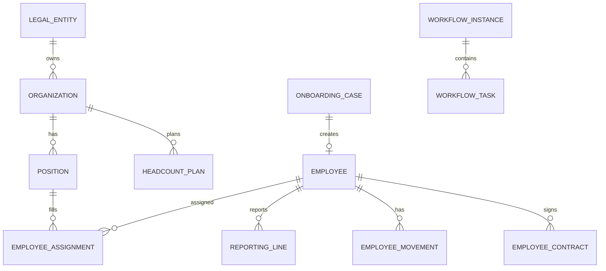

# 领域模型与表设计（MVP）

> AI 编写 Entity / Migration / API 前的权威参考。字段名 DB 用 snake_case，API 用 camelCase。

## 1. 命名约定

| 项 | 约定 |
| --- | --- |
| 主键 | `BIGINT` 雪花或自增 `id` |
| 业务编码 | `code` VARCHAR(64) UNIQUE，与 id 分离 |
| 外键 | `{entity}_id` |
| 软删 | `deleted_at` DATETIME NULL（可选，MVP 可用 `is_deleted`） |
| 审计 | `created_at`, `updated_at`, `created_by`, `updated_by` |
| 租户 | 单企业部署 MVP 可不加；SaaS 化加 `tenant_id` |

## 2. 平台域

### sys_user

| 字段 | 类型 | 说明 |
| --- | --- | --- |
| id | BIGINT PK | |
| username | VARCHAR(64) UNIQUE | 登录名 |
| password_hash | VARCHAR(255) | |
| employee_id | BIGINT NULL | 关联员工，可为空（纯管理员） |
| status | VARCHAR(32) | ACTIVE / DISABLED |
| last_login_at | DATETIME | |

### role / permission / user_role / role_permission

标准 RBAC。`permission.code` 示例：`org:view`, `employee:edit`, `salary:view`, `audit:view`。

### audit_log

| 字段 | 说明 |
| --- | --- |
| action | VIEW / CREATE / UPDATE / DELETE / EXPORT |
| resource_type | employee / payroll / org ... |
| resource_id | |
| detail_json | 变更摘要，敏感值脱敏 |
| ip_address | |

## 3. 组织域

### organization

| 字段 | 类型 | 说明 |
| --- | --- | --- |
| id | BIGINT PK | |
| code | VARCHAR(64) | 八位部门编号 |
| name | VARCHAR(128) | |
| parent_code | VARCHAR(64) NULL | 上级部门编号 |
| parent_id | BIGINT NULL | 根节点 NULL |
| org_type | VARCHAR(32) | COMPANY / DIVISION / DEPARTMENT / TEAM |
| department_type | VARCHAR(64) NULL | 部门类型（字典） |
| location | VARCHAR(64) NULL | 地点（字典） |
| legal_company | VARCHAR(64) NULL | 法人公司（字典） |
| department_level | VARCHAR(64) NULL | 部门层级（字典） |
| cost_center | VARCHAR(128) NULL | 成本中心（自由文本，非主数据关联） |
| org_leader_no | VARCHAR(64) NULL | 组织负责人工号 |
| supervising_leader_no | VARCHAR(64) NULL | 分管领导工号 |
| org_attribute | VARCHAR(16) NULL | PHYSICAL / VIRTUAL |
| org_function | VARCHAR(32) NULL | RND / MANUFACTURING / MARKET / FUNCTION |
| org_tags | VARCHAR(255) NULL | 组织标签 |
| financial_code | VARCHAR(64) NULL | 财务编码 |
| hr_coordinator_no | VARCHAR(64) NULL | 人资协调员工号 |
| hrbp_no | VARCHAR(64) NULL | HRBP 工号 |
| ssc_no | VARCHAR(64) NULL | SSC 工号 |
| effective_start_date | DATE | **生效开始** |
| effective_end_date | DATE NULL | **生效结束，NULL=当前** |
| status | VARCHAR(32) | ACTIVE / INACTIVE |

索引：`(parent_id, effective_start_date)`, `(code, effective_end_date)`。

> **说明**：`cost_center` 主数据表 MVP 不做；组织上仅保留文本字段供部门属性填写。

### position

| 字段 | 说明 |
| --- | --- |
| organization_id | 所属组织 |
| job_id | 关联职务 |
| code, name | |
| headcount | 岗位编制数 |
| status | |

### job / job_grade / job_level

职务与职级职等，供岗位、任职引用。

### legal_entity

法人实体：名称、统一社会信用代码、地区。

### headcount_plan

| 字段 | 说明 |
| --- | --- |
| organization_id | 部门 |
| fiscal_year | 年度 |
| planned_count | 计划编制 |
| occupied_count | 已占用（冗余，事件更新） |
| reserved_count | 在途 offer/入职 |

## 4. 员工域

### employee

| 字段 | 类型 | 说明 |
| --- | --- | --- |
| id | BIGINT PK | |
| employee_no | VARCHAR(64) UNIQUE | 工号 |
| full_name | VARCHAR(128) | |
| gender | VARCHAR(16) | |
| mobile | VARCHAR(32) | 加密存储 |
| email | VARCHAR(128) | |
| id_card_no | VARCHAR(64) | 加密 |
| hire_date | DATE | 首次入职日 |
| status | VARCHAR(32) | CANDIDATE / PROBATION / ACTIVE / TERMINATED |
| user_id | BIGINT NULL | 绑定登录账号 |

### employee_assignment（任职 — 核心）

| 字段 | 说明 |
| --- | --- |
| employee_id | |
| organization_id | |
| position_id | |
| job_grade_id | |
| employment_type | FULL_TIME / PART_TIME / INTERN |
| is_primary | 是否主任职 |
| effective_start_date | **必填** |
| effective_end_date | NULL=当前有效 |
| status | ACTIVE / ENDED |

**规则**：同一员工同一时段仅一条 `is_primary=1` 且 `effective_end_date IS NULL` 的主任职。

### reporting_line

| 字段 | 说明 |
| --- | --- |
| employee_id | 下属 |
| manager_employee_id | 上级 |
| effective_start_date | |
| effective_end_date | |
| line_type | DIRECT / DOTTED |

### employee_movement（异动事件）

| 字段 | 说明 |
| --- | --- |
| employee_id | |
| movement_type | HIRE / REGULARIZE / TRANSFER / PROMOTE / TERMINATE |
| effective_date | |
| from_assignment_id | NULLABLE |
| to_assignment_id | NULLABLE |
| reason | |
| source_request_id | 关联业务单据 |

## 5. 入转调离域

### onboarding_case

| 字段 | 说明 |
| --- | --- |
| case_no | 单据号 |
| candidate_name | 待入职姓名 |
| organization_id, position_id | 预分配 |
| expected_hire_date | |
| status | 状态机枚举 |
| workflow_instance_id | |
| employee_id | 完成后回填 |

### regularization_request / transfer_request / offboarding_case

结构类似：单据号、employee_id、状态、workflow_instance_id、业务字段 JSON 或独立列。

### employee_contract

| 字段 | 说明 |
| --- | --- |
| employee_id | |
| contract_type | LABOR / INTERN ... |
| start_date, end_date | |
| status | DRAFT / ACTIVE / EXPIRED / TERMINATED |
| file_attachment_id | 合同扫描件 |

## 6. 流程域

### workflow_definition

`code`, `name`, `version`, `definition_json`（节点、连线、审批人规则）。

### workflow_instance

`definition_id`, `business_type`, `business_id`, `status`, `initiator_id`。

### workflow_task

`instance_id`, `node_key`, `assignee_id`, `status`（PENDING/APPROVED/REJECTED）, `comment`, `completed_at`。

## 7. 员工服务域

### certificate_request

`employee_id`, `certificate_type`, `purpose`, `status`, `workflow_instance_id`, `issued_file_id`。

## 8. ER 关系（MVP  subset）



## 9. 状态枚举（须在 shared 与 Java Enum 同步）

```typescript
// shared/api.interface.ts 中维护
export type EmployeeStatus = 'CANDIDATE' | 'PROBATION' | 'ACTIVE' | 'TERMINATED';
export type OnboardingStatus = 'DRAFT' | 'PENDING' | 'IN_PROGRESS' | 'COMPLETED' | 'CANCELLED';
export type OffboardingStatus = 'APPLIED' | 'APPROVING' | 'HANDOVER' | 'SETTLING' | 'COMPLETED';
```

## 10. 敏感字段清单

| 表.字段 | 存储 | 展示 |
| --- | --- | --- |
| employee.mobile | AES 加密 | 138****1234 |
| employee.id_card_no | AES 加密 | 脱敏 |
| employee_bank_account（后期） | AES | 尾号四位 |

查看明文需 `employee:sensitive:view` 权限并写 audit_log。
